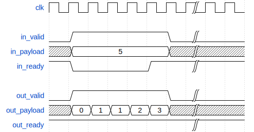
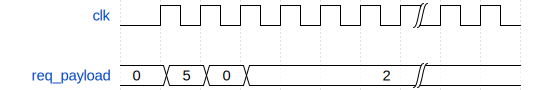
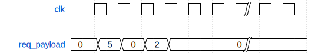
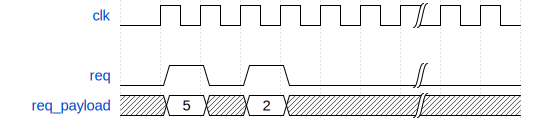
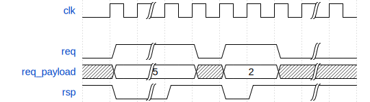
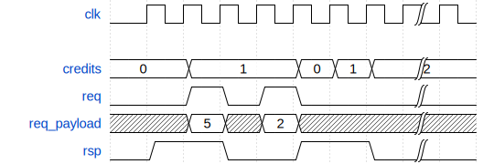

# Introduction

Large digital designs can have hundreds of blocks organized into clusters, with verification done typically done at block, cluster and top levels, generally using UVM. A single block can itself be quite large, consisting of anywhere between a handful to a hundred modules. Testing these lower level modules is sometimes left to the block-level (or higher) verification environment, which results in a longer turnaround. Building UVM testbenches for each lower-level module is generally not practical either. While not impossible, this approach has issue that a UVM testbench can only run one test at a time and that there's no inbuilt mechanism to consolidate the results of multiple runs.

SvUTest is a framework that helps designers write sanity checks on their blocks with minimal overhead. With support for concurrent regressions and inbuilt consolidation of results, this framework enables faster design sign-off.

SvUTest is meant to be used by RTL design engineers to ensure basic sanity of small designs across a known set of input patterns. This framework is not meant to be a replacement for UVM and is only recommended for small System Verilog modules with a handful of input/output interfaces whose output can be predicted for a known set of inputs. UVM would still be the go-to solution for large designs with complex stimuli.

# Deep dive into a regression

### Design under test

Let's look at the fibonacci sequence generator module in [examples/002_fibonacci/fibonacci.sv](../examples/002_fibonacci/fibonacci.sv):

```systemverilog
module fibonacci
(
    input  logic        clk,
    input  logic        rst,
    
    input  logic        in_valid,
    input  logic [7:0]  in_data,
    output logic        in_ready,
    
    output logic        out_valid,
    output logic [31:0] out_data,
    input  logic        out_ready
);
```

This module produces ``in_data`` number of output transcations where each transcation is a number in the Fibonacci sequence, starting from 0, for each input transaction:



It has two valid-ready-data interfaces, one for input and one for output, in addition to clock and reset.

### Test Top

Test top is a wrapper around the DUT and needs to be built once per DUT. The test top for the fibonacci module looks thus:

```systemverilog
module fibonacci_utest_top
#(
    type T_test_case = bit
)(
    svutest_test_ctrl_if.target tc
);
    svutest_dut_ctrl_if dc ();
    
    svutest_req_payload_rsp_if#(logic[7:0]) in (dc.clk, dc.rst);
    svutest_req_payload_rsp_if#(logic[31:0]) out (dc.clk, dc.rst);
    
    // ---------------------------------------------------------------------- //
    
    fibonacci u_fib (
        .clk        (dc.clk),
        .rst        (dc.rst),
        
        .in_valid   (in.req),
        .in_data    (in.req_payload),
        .in_ready   (in.rsp),
        
        .out_valid  (out.req),
        .out_data   (out.req_payload),
        .out_ready  (out.rsp)
    );
    
    always_comb dc.done = ~(in.req | out.req);
    
    // ---------------------------------------------------------------------- //
    
    initial begin
        T_test_case test = new(tc, dc, in, out);
        test.run();
    end
endmodule
```

The test top needs to accept a compile time parameter test_case which describes a test case that runs on the DUT and an interface port of type ``svutest_test_ctrl_if.target`` which controls the simulation of the DUT.

The test top further instantiates all the SV interfaces that connect to the DUT, including clock and reset. Clock and reset are controlled by a built-in interface called ``svutest_dut_ctrl_if``. ``svutest_dut_ctrl_if`` also has an signal called ``done`` which the test top should drive to logic high to indicate the DUT is done processing the workload.

The test top needs to create an instance of ``T_test_case`` inside an ``initial`` block and call ``run()`` on it. The constructor for ``T_test_case`` needs to accept the ``svutest_test_ctrl_if``, ``svutest_dut_ctrl_if`` and other interfaces. ``svutest_req_payload_rsp_if`` is a built-in interface that supports a request-response handshake with a parameterizable payload for the request.

### Test case base class

Once the test_top is built, a test case base class that drives the input interfaces and evaluates the output transactions needs to be created by deriving from ``svutest_pkg::test_case``. This class acts as a base class for all test sequences for the current DUT. ``svutest_pkg::test_case`` class drives the clock and reset to the DUT while monitoring the ``done`` in addition to providing hoooks to manage the input and output interfaces of the DUT. The constructor of ``svutest_pkg::test_case`` accepts the svutest_test_ctrl_if interface, svutest_dut_ctrl_if interface and a test name as arguments. The example below creates a base class called ``fibonacci_utest``:

```systemverilog
virtual class fibonacci_utest extends test_case;
    valid_data_ready_injector#(logic[7:0]) m_in_injector;
    valid_data_ready_extractor#(logic[31:0]) m_out_extractor;
    
    function new (
        virtual svutest_test_ctrl_if.target vif_test_ctrl,
        virtual svutest_dut_ctrl_if.driver vif_dut_ctrl,
        virtual svutest_req_payload_rsp_if#(logic[7:0]).driver vif_in,
        virtual svutest_req_payload_rsp_if#(logic[31:0]).target vif_out,
        string test_case_name
    );
        super.new(vif_test_ctrl, vif_dut_ctrl, $sformatf("fibonacci:%0s", test_case_name));
        
        m_in_injector = new(vif_in);
        m_out_extractor = new(vif_out);
        
        this.add(m_in_injector);
        this.add(m_out_extractor);
    endfunction
endclass
```

An injector or an extractor needs to be created per interface, depending on the direction of the transaction. The example above creates one injector and one extractor inside the class. The constructor of ``fibonacci_utest`` must attach each injector/extractor to the test case by calling the ``add()`` method of ``svutest_pkg::test_case``.

The base class is built once per DUT.

### Test case classes

Once the injectors and extractors are set up, the user needs to extend the base class for each test scenario and override two virtual functions ``test_case::populate()`` and ``test_case::check()``. ``populate()`` is used to populate the input data for all the injectors. The injector class provides a function ``put()`` to push a transaction into its internal queue. Any number of ``put()`` calls may be made from the ``populate`` function. The actual injection of the transactions to the DUT will be done later, once the simulation starts.

The transactions emitted from the output channels of the DUT are collected by the extractor and populated into an internal queue. This queue can be accessed from using the method ``extractor::get_queue()`` inside the virtual function ``check()``  and queried for correctness. Two macros ``SVUTEST_ASSERT(expr)`` and ``SVUTEST_ASSERT_EQ(expr_lhs, expr_rhs)`` are provided in ``svutest_defines.svh`` to help the user with the line numbers and a summary.

The following snippet shows a test case that tells the DUT to emit five fibonacci numbers and verifies the outputs:
```systemverilog
class fibonacci_utest_5 extends fibonacci_utest;
    function new (
        virtual svutest_test_ctrl_if.target vif_test_ctrl,
        virtual svutest_dut_ctrl_if.driver vif_dut_ctrl,
        virtual svutest_req_payload_rsp_if#(logic[7:0]).driver vif_in,
        virtual svutest_req_payload_rsp_if#(logic[31:0]).target vif_out
    );
        super.new(vif_test_ctrl, vif_dut_ctrl, vif_in, vif_out, "5");
    endfunction
    
    function void populate ();
        m_in_injector.put(5);
    endfunction
    
    function void check ();
        logic [31:0] out_queue [$] = m_out_extractor.get_queue();
        
        `SVUTEST_ASSERT_EQ(out_queue.size(), 5)
        
        `SVUTEST_ASSERT_EQ(out_queue[0], 0)
        `SVUTEST_ASSERT_EQ(out_queue[1], 1)
        `SVUTEST_ASSERT_EQ(out_queue[2], 1)
        `SVUTEST_ASSERT_EQ(out_queue[3], 2)
        `SVUTEST_ASSERT_EQ(out_queue[4], 3)
    endfunction
endclass
```

Any number of test cases can be specified for a DUT.

### Regression top module

Once the test top and test cases are set up, we need to populate a top module where we
1. Create an instance of ``svutest_test_ctrl_if``
1. Create an instance of test top for each test scenario, while passing the test case in the parameter list, and the instance of ``svutest_test_ctrl_if`` created above as a port
1. A macro called ``SVUTEST`` is provided that performs both the above operations in one line
1. Create a instance of ``test_list`` in an ``initial`` block and add to it all the ``svutest_test_ctrl_if`` instances that we created in step 1
1. Call the ``run()`` method on the test list

Shown below is a sample regression top for two test cases:
```systemverilog
module regress_top;
    import svutest_pkg::*;
    import fibonacci_utest_pkg::*;
    
    svutest_test_ctrl_if i_fibonacci_utest_3 ();
    fibonacci_utest_top u_fibonacci_utest_3 (i_fibonacci_utest_3);
    `SVUTEST(fibonacci_utest_top, fibonacci_utest_5)
    
    initial begin
        test_list list = new();
        
        list.add(i_fibonacci_utest_3);
        list.add(i_fibonacci_utest_5);
        
        list.run();
    end
endmodule
```

For a complete regression top module, please see [examples/regress_top.sv](../examples/regress_top.sv)

### Test list

The class ``svutest_pkg::test_list`` provides an ``add()`` method to add a test case to the list of tests that are run. ``add()`` takes the an instance of ``svutest_test_ctrl_if`` as the argument.

The method ``append()`` allows a test list to be merged with another one, creating a larger list. This gives the user finer control over the list of tests at run time.

The ``test_list::run()`` method runs all instantiated test cases, in no specific order, and prints a summary on the console. The summary can be printed in color by passing +svutest_color to the simulation environment:
```
        8000 | fibonacci:3> COMPLETE. Assertions: 4/4 [PASS]
       10000 | fibonacci:5> COMPLETE. Assertions: 6/6 [PASS]
       10000 | Status: PASS | Total: 1, Unresponsive: 0, Timeout: 0, Unchecked: 0, Fail: 0, Pass: 2
```

Any number of test lists may be created, based on compile time or run time conditions.

# Built-ins

## Interfaces

SvUTest provides a list of interfaces that the user can purpose for various protocols:

### svutest_test_ctrl_if
This interface is used by the simulation engine to control individual tests in a regression. The user needs to instantiate this once per test case in the regress top either manually or using the macro SVUTEST, however, no assumption should be made about its internals

### svutest_dut_ctrl_if
``svutest_dut_ctrl_if`` is used to drive the clock and reset from a test case tot he DUT. The ``done`` signal on this interface must be driven from the test top to indicate the workload has drained from the DUT and the test is done.

### svutest_payload_if
An interface with a single parameterized payload

### svutest_req_payload_if
An interface with a single-bit ``req`` signal and a parameterized ``req_payload``

### svutest_req_payload_rsp_if
Contains a single bit ``req``, a parameterized ``req_payload`` and a single-bit ``rsp``. This interface is generally used to carry the valid-data-ready protocol.

## Injectors and extractors

### injector

An injector connects to the input of a DUT and drives transactions. Injectors are derived from ``svutest_pkg::injector``. This class provides two methods:

1. ``put(value)``: Drives the specified value on an interface
1. ``put_delay()``: Drives a default or empty value on an interface for a single clock cycle

The user may derive classes from ``injector`` to drive custom protocols to a DUT.

### level_data_injector

The ``level_data_injector`` drives multiple values on a ``svutest_payload_if``, with each value lasting a clock cycle, while the last value sticks. The following code snippet produces the subsequent transactions on a ``svutest_payload_if``:

```systemverilog
level_inj.put(5);
level_inj.put_delay();
level_inj.put(2);
```



### pulse_data_injector

The ``pulse_data_injector`` drives multiple values on a ``svutest_payload_if``, with each value lasting a clock cycle, while the interface is driven to the default value (0) after the last drive. The following code snippet shows how a pulse injector drives values:

```systemverilog
pulse_inj.put(5);
pulse_inj.put_delay();
pulse_inj.put(2);
```



### valid_data_injector

The ``valid_data_injector`` drives multiple values on a ``svutest_req_payload_if``, with each value lasting a clock cycle while ``req`` being high. The payload is reset to x after each drive:

```systemverilog
valid_data_inj.put(5);
valid_data_inj.put_delay();
valid_data_inj.put(2);
```



### valid_data_ready_injector

The ``valid_data_ready_injector`` drives values on a ``svutest_req_payload_rsp_if``. On each drive, ``req`` is driven high, while ``req_payload`` is driven the value specified, and both are maintianed until the ``rsp`` is driven high by the DUT. ``req_payload`` is driven x in the absence of a valid drive:

```systemverilog
valid_data_ready_inj.put(5);
valid_data_ready_inj.put_delay();
valid_data_ready_inj.put(2);
```



### credit_write_injector

``credit_write_injector`` drives values on a ``svutest_req_payload_rsp_if`` by setting ``req`` high for one cycle while driving ``req_payload`` to the specified value. This class has an internal counter that keeps track of the number of pulses received on ``rsp`` (credits) and a drive happens only when this counter is non-zero. This counter is incremented whenever a pulse is received on ``rsp`` and decremented on each drive. ``req_payload`` is driven x in the absence of a ``req``. Initial value of the internal counter can be specified in the constructor to control how many transactions can be sent out before the target sends the first set of credits:

```systemverilog
credit_write_inj = new(vif, 0); // No initial credits
credit_write_inj.put(5);
credit_write_inj.put_delay();
credit_write_inj.put(2);
```



### extractor

An extractor conencts to the output of a DUT and drives responses as well as captures the transctions and stores them internally. ``svutest_pkg::extractor`` is the base class from which all extractors are derived. This class provides two methods:

1. ``put_rsp()``: Let's the user supply a response on specific interfaces. This is typically used to add delays on ``svutest_req_payload_rsp_if`` by driving ``0`` on ``rsp``.
1. ``get_queue()``: Returns the extractor's internal queue that holds the transactions emitted from the DUT

### valid_data_extractor

``valid_data_extractor`` captures and stores transcations emitted by the DUT on a ``svutest_req_payload_if`` interface, assuming valid-data protocol. Calling ``put_rsp`` on this extractor has no effect.

### valid_data_ready_extractor

``valid_data_ready_extractor`` captures and stores transcations emitted by the DUT on a ``svutest_req_payload_rsp_if`` interface, assuming valid-data-ready protocol. The ``rsp`` signal is internally driven to 1 at the start of simluation to allow all transactions from the DUT to drain into the extractor's queue without delay. Each ``put_rsp(value)`` has the effect of delaying the transaction by one clock if ``value`` is zero and has no effect if ``value`` is 1.

## Macros

### SVUTEST(test_top, test_case)

Creates an instance of ``svutest_test_ctrl_if``, with the name ``i_test_case``. Creates an instance of ``test_top`` while passing ``test_case`` as the first argument and passing ``i_test_case`` as the only port.

### SVUTEST_PARAM(test_top, test_case, param)

Creates an instance of ``svutest_test_ctrl_if``, with the name ``i_test_case_param``. Creates an instance of ``test_top`` while passing ``test_case`` as the first argument, ``param`` as the second argument and passing ``i_test_case`` as the only port. ``test_top`` needs ensure that two arguments exist in the parameter list.

### SVUTEST_ASSERT(expr)

Evaluates ``expr`` and prints an error message if false, while incrementing the number of failures for the given test case. Increments a pass counter is ``expr`` evaluates to true instead. The number of passes and fails is used while printing out the test summary.

### SVUTEST_ASSERT_EQ(expr_expected, expr_actual)

Comapres ``expr_expected`` against ``expr_actual`` while incrementing the number of pass counter or fail counter depending on evaluation outcome. An error is printed with the line number, expected and actual values if the evaluation fails.
